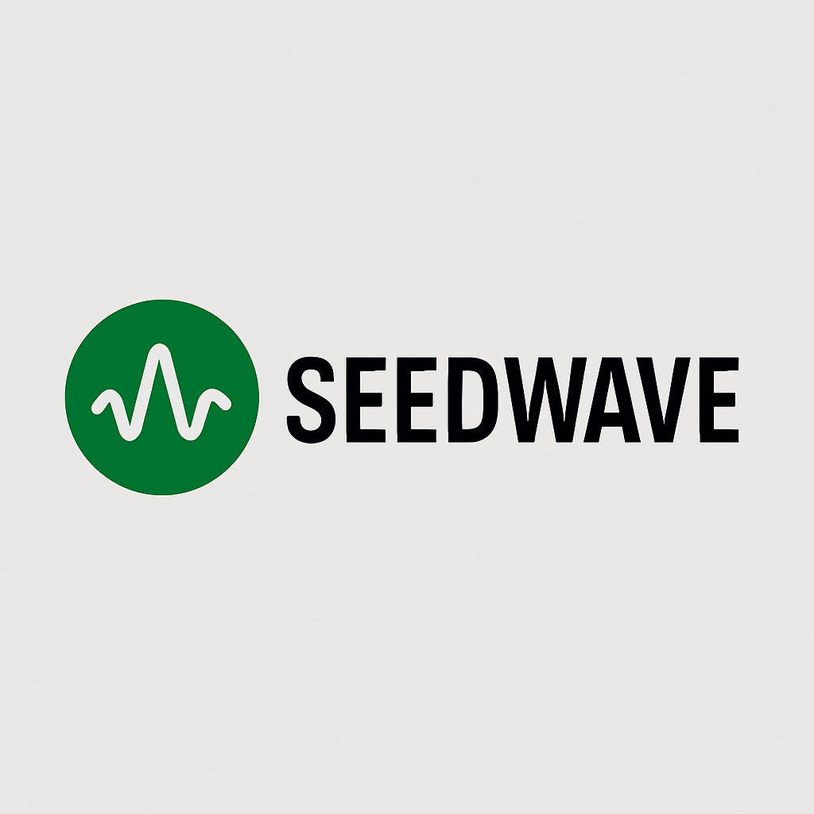

 

# 🍜 **The Epic Journey of Noodle Mountain** 🏔️🐑☀️

Welcome, traveler, to the mystical realm of Noodle Mountain, a canvas born from simplicity, elevated by imagination, and sustained by kind creatures and global impact! This document unveils the legendary tale behind the vibrant scene you behold.

## **Table of Contents**

* [About Noodle Mountain](#about-noodle-mountain)
* [The Genesis: From the Pot's Depths](#the-genesis-from-the-pots-depths)
* [The Canvas Unfolds: A Tapestry of Borders](#the-canvas-unfolds-a-tapestry-of-borders)
* [The Inhabitants: Sheep of the Noodle Mountain](#the-inhabitants-sheep-of-the-noodle-mountain)
* [The Dawn: Snow Melts, Grass Flows](#the-dawn-snow-melts-grass-flows)
* [The Foundation: Banimal™'s Solid Ground](#the-foundation-banimals-solid-ground)
* [Getting Started](#getting-started)
    * [Prerequisites](#prerequisites)
    * [Installation](#installation)
* [Usage](#usage)
* [Contributing](#contributing)
* [License](#license)
* [Contact](#contact)
* [Acknowledgements](#acknowledgements)

## **About Noodle Mountain**

This project is a whimsical yet profound canvas, illustrating a journey of creation from a simple concept to a rich, layered world. It's a testament to how imagination can transform the mundane into the magnificent, supported by principles of kindness and global impact embodied by Banimal™.

## **The Genesis: From the Pot's Depths** 🍲✨

Our journey begins not with grand designs, but with a humble thought, as simple as a child's: "What if a spaghetti noodle, fresh from the supermarket pack, perfectly cooked, could transcend its culinary destiny?"

And so, from the swirling depths of a *pitch-black pot*, a singular, magnificent **black noodle** emerged. Not pulsing, not flailing, but a long, flexible strand, tossed with care across the blank canvas of existence. It stretched from left to right, bending and weaving in 6, 7, even 8 elegant curves, a solid, steadfast line – an *iframe noodle*, distinct and unyielding, just like the borders of the world it would soon inhabit.

## **The Canvas Unfolds: A Tapestry of Borders** 🎨🌈

Before our noodle could truly ascend, the very fabric of its world had to be woven. Layers upon layers of vibrant meaning emerged, each 2mm thick, a testament to precision and vision:

* First, a **shocking red** border, bold and audacious.

* Then, a **shocking yellow**, radiating energy and new beginnings.

* Next, a **grass green**, hinting at life and flourishing landscapes.

* And finally, a **super pearl white** innermost panel, pure and boundless, awaiting its destiny.

This majestic stack, a masterpiece of **concentric borders**, formed the very foundation upon which our noodle would rest, turning its simple bends into towering **mountain peaks**.

## **The Inhabitants: Sheep of the Noodle Mountain** 🐑🧡

No mountain is complete without its inhabitants! On the highest peak of the black noodle, and then on a slightly lower crest, appeared the first of our *kind creatures*: the **Noodle Mountain Sheep**. Their tiny, gentle feet found perfect purchase on the noodle line, guardians of this extraordinary landscape.

## **The Dawn: Snow Melts, Grass Flows** 🌄🌿

For six long months and eighteen days, Noodle Mountain was blanketed in pristine snow, a testament to the quiet patience of nature. But then, across the noodle's high horizon, the majestic **mountain sun** began its glorious **sunrise**. Its golden rays, subtle and peaceful, cascaded down the slopes.

As the sunlight touched the peaks, a miracle unfolded. The snow, once a stark white, began to **melt slowly, subtly, peacefully**. Beneath its retreating veil, the **green grass** of the veld began to show, flowing down the side of the mountain like a gentle river of life, creating a lush, vibrant contrast to the winter brown grass below.

## **The Foundation: Banimal™'s Solid Ground** 🐾🌳

Beneath this fantastical realm, a new, solid foundation emerged: the **Banimal™** footer. Like a corporate header, yet grounded in the earth, this "winter brown grass" expanse provides a clear, visible deployment area. It's here, on this stable ground, that the sheep can truly play, finding their space (about 25% of the white canvas, with a proud 2mm border from the edges).

Here, the story of **Banimal™: Kind Creatures. Global Impact.** is told. Discover thoughtful baby essentials & innovative lighting, knowing that for every purchase, the same item is delivered to a child in need, powered by the insightful data of the Baobab Security Network. A true **epic journey** of kindness and purpose.

## **Getting Started**

To experience the Noodle Mountain canvas, you can clone this repository and open the `index.html` file in your web browser.

### **Prerequisites**

* A modern web browser (e.g., Chrome, Firefox, Edge, Safari).

### **Installation**

1. Clone the repository to your local machine:

   ```bash
   git clone [https://github.com/yourusername/noodle-mountain.git](https://github.com/yourusername/noodle-mountain.git)
   Navigate to the project directory:

Bash

cd noodle-mountain
Open the index.html file in your preferred web browser.

Usage
Once opened, the index.html file will display the Noodle Mountain canvas. You can explore the visual elements and the story they tell.

Contributing
While this project is primarily a narrative art piece, creative contributions that enhance the visual storytelling or add interactive elements are welcome. Please fork the repository and submit a pull request with your proposed changes.

License
This project is open-source. Please refer to the LICENSE file for details.

Contact
For any inquiries or collaborations, please reach out.

Acknowledgements
Inspired by the simple beauty of everyday objects.

Dedicated to the spirit of kindness and global impact.

Thank you for embarking on this incredible journey with us! 🙏
