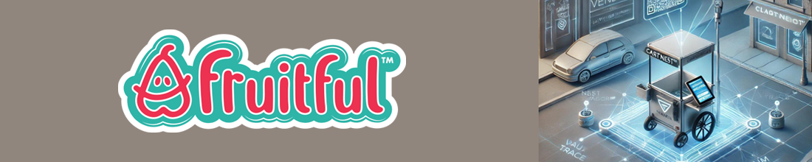
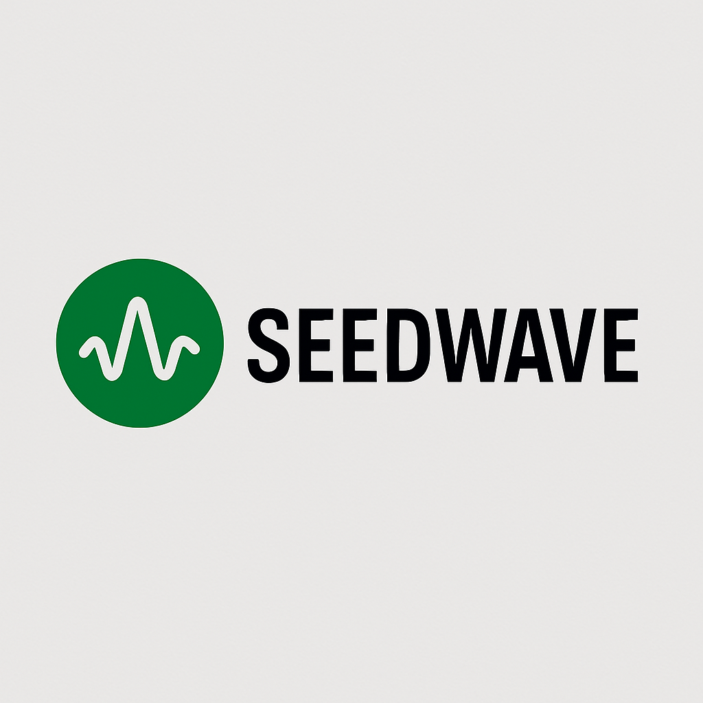

<p align="center">
  
</p>

# Seedwave

**Central admin portal & serverless backend — Fruitful™ / FAA ecosystem**
`heyns1000/seedwave` · JavaScript (Node/Express) · HTML · Python

> Factual header added 13 June 2026, verified against live GitHub via the
> `fruitful-ecosystem-auditor` skill. The original project README ("The Epic
> Journey of Noodle Mountain") is preserved in full below this divider.

## Repository facts (verified)

| Metric | Value |
|---|---|
| Default branch | `main` |
| Branches | 5 |
| Files on `main` (incl. `node_modules`) | 4,803 |
| Project source files (excl. `node_modules`) | 66 |
| Primary languages | JavaScript (Node/Express), HTML, Python (Flask) |
| Deploy target | Vercel (`vercel.json` at root and in `server/`) |

> **On file counts:** the tree shows 4,803 entries, but 4,737 are committed
> `node_modules/` (vendored dependencies). The real project surface is **66
> files**. Quote 66, not the dependency-inflated total.

## What this repo is

Seedwave is the central administration portal and serverless backend layer for
the Fruitful™ / FAA ecosystem. It is not a single page or a prototype; it is
the operator-facing control plane — the place where the ecosystem's brands,
sectors, licences, checkout flows, and account states are administered and
served.

The repository holds three working parts in one tree:

1. A **Node/Express serverless backend** (`server/server.js`, `api/index.js`)
   deployed on Vercel.
2. A **static front end of ~41 admin and portal pages** under `public/`.
3. A small, self-contained **Python/Flask PayFast payment app**
   (`my_payfast_app/`).

## The Seedwave system (in depth)

### Backend — Express on Vercel

The deployable application is an Express server exposed through Vercel's
serverless runtime. `server/server.js` is the primary server entry; `api/index.js`
is the Vercel function handler; `vercel.json` (present at both the repo root and
inside `server/`) defines the routing and build configuration. `package.json`
and `package-lock.json` pin the Node dependency set (the committed `node_modules/`
mirrors that lockfile). This is the layer that authenticates operators, serves
the admin pages, and brokers the payment integrations.

### Front end — the admin and portal surface (`public/`, 41 files)

The `public/` directory is the heart of Seedwave: it is the operating console
for the whole ecosystem. The pages group into clear functions.

**Administration & ledger**
- `admin-panel.html`, `admin-portal.html`, `heyns_admin_panel.html`,
  `heyns_admin_panel_paypal.html` — the operator control panels.
- `admin-license-ledger.html` — the licence ledger view (issuance / status of
  ecosystem licences).
- `admin_panel_xero.html` — Xero-facing accounting panel.
- `clause-index.html` — legal/clause index.

**Ecosystem & sector navigation**
- `ecosystem-dashboard.html`, `fruitful_dashboard.html` — top-level dashboards.
- `sector-grid.html`, `fruitful_global_sector_index.html` — sector indices.
- `global.html`, `global_brands.html`, `fruitful_global_sector_index.html` —
  the global brand / sector views that act as the front face of the ecosystem.
- `node-status.html`, `signal-sync.html`, `scrollmap.html` — status and
  sync/telemetry views.

**Commerce & checkout**
- `checkout_form.html`, `global_checkout.html` — checkout flows.
- `products.html`, `quick-view.html` — product surfaces.
- `subscription-cancelled.html`, `subscription-failed.html` — subscription
  state pages.
- `sectors/agriculture-biotech/agrichain/paypal/pricing.html` — a worked
  sector pricing example wired to PayPal.

**Access & accounts**
- `login.html`, `signup.html`, `access-portal.html`, `welcome.html`,
  `homepage.html`, `unauthorized.html` — the authentication and entry surface.

**Brand-specific & misc**
- `seedwave.html`, `planet_for_change.html`, `foxed_has_mobiles.html`,
  `index.html`, `index_progress.html` — brand and landing pages.
- `html-project/` — a sub-project with its own light/dark themes and legal
  pricing pages.

### Payments — PayFast (Python/Flask)

`my_payfast_app/` is a small, isolated Flask application handling PayFast
(South African gateway) flows: `app.py` (the server), `config.py`
(configuration), and `templates/` with `payfast_form.html`, `success.html`,
and `cancelled.html`. Alongside the PayPal-wired admin pages, this gives
Seedwave two live payment paths — PayPal (international) and PayFast (ZAR).

### Integrations

PayPal and PayFast for payments; Xero for accounting; Zoho referenced in the
admin layer. All served and brokered through the Express/Vercel backend.

## Housekeeping (recommended)

- **`node_modules/` is committed** — 4,737 of the 4,803 tree entries are
  vendored dependencies. Add `node_modules/` to `.gitignore` and remove it from
  the tree; it inflates the file count ~70×.
- **`.env.local` is committed and contains live credentials** — this is a
  **public** repo. Rotate any PayPal / PayFast / Xero keys that were ever in
  that file and stop tracking environment files. A secret is compromised the
  moment it is pushed to a public repo.
- **`.DS_Store` files** are committed throughout (`public/`, `api/`,
  `my_payfast_app/`) — add to `.gitignore` and remove.
- **Licence** standardised in this pass to Fruitful Shops Proprietary v1.1
  (eff. 13 Jun 2026).

## For agents (Claude, Perplexity, or otherwise)

Verify before you repeat. Exclude `node_modules/` before quoting a file count
for this repo — the real source is 66 files, not 4,803. Treat any brand/sector
totals in the narrative below as creative, not measured, unless a source file
in the tree backs them.

---
---



# 🍜 **The Epic Journey of Noodle Mountain** 🏔️🐑☀️

Welcome, traveler, to the mystical realm of Noodle Mountain, a canvas born from simplicity, elevated by imagination, and sustained by kind creatures and global impact! This document unveils the legendary tale behind the vibrant scene you behold.

## **Table of Contents**

* [About Noodle Mountain](#about-noodle-mountain)
* [The Genesis: From the Pot's Depths](#the-genesis-from-the-pots-depths)
* [The Canvas Unfolds: A Tapestry of Borders](#the-canvas-unfolds-a-tapestry-of-borders)
* [The Inhabitants: Sheep of the Noodle Mountain](#the-inhabitants-sheep-of-the-noodle-mountain)
* [The Dawn: Snow Melts, Grass Flows](#the-dawn-snow-melts-grass-flows)
* [The Foundation: Banimal™'s Solid Ground](#the-foundation-banimals-solid-ground)
* [🎵 The Bad Boys Noodle Protocol](#-the-bad-boys-noodle-protocol)
* [Getting Started](#getting-started)
    * [Prerequisites](#prerequisites)
    * [Installation](#installation)
* [Usage](#usage)
* [Contributing](#contributing)
* [License](#license)
* [Contact](#contact)
* [Acknowledgements](#acknowledgements)

## **About Noodle Mountain**

This project is a whimsical yet profound canvas, illustrating a journey of creation from a simple concept to a rich, layered world. It's a testament to how imagination can transform the mundane into the magnificent, supported by principles of kindness and global impact embodied by Banimal™.

## **The Genesis: From the Pot's Depths** 🍲✨

Our journey begins not with grand designs, but with a humble thought, as simple as a child's: "What if a spaghetti noodle, fresh from the supermarket pack, perfectly cooked, could transcend its culinary destiny?"

And so, from the swirling depths of a *pitch-black pot*, a singular, magnificent **black noodle** emerged. Not pulsing, not flailing, but a long, flexible strand, tossed with care across the blank canvas of existence. It stretched from left to right, bending and weaving in 6, 7, even 8 elegant curves, a solid, steadfast line – an *iframe noodle*, distinct and unyielding, just like the borders of the world it would soon inhabit.

## **The Canvas Unfolds: A Tapestry of Borders** 🎨🌈

Before our noodle could truly ascend, the very fabric of its world had to be woven. Layers upon layers of vibrant meaning emerged, each 2mm thick, a testament to precision and vision:

* First, a **shocking red** border, bold and audacious.

* Then, a **shocking yellow**, radiating energy and new beginnings.

* Next, a **grass green**, hinting at life and flourishing landscapes.

* And finally, a **super pearl white** innermost panel, pure and boundless, awaiting its destiny.

This majestic stack, a masterpiece of **concentric borders**, formed the very foundation upon which our noodle would rest, turning its simple bends into towering **mountain peaks**.

## **The Inhabitants: Sheep of the Noodle Mountain** 🐑🧡

No mountain is complete without its inhabitants! On the highest peak of the black noodle, and then on a slightly lower crest, appeared the first of our *kind creatures*: the **Noodle Mountain Sheep**. Their tiny, gentle feet found perfect purchase on the noodle line, guardians of this extraordinary landscape.

## **The Dawn: Snow Melts, Grass Flows** 🌄🌿

For six long months and eighteen days, Noodle Mountain was blanketed in pristine snow, a testament to the quiet patience of nature. But then, across the noodle's high horizon, the majestic **mountain sun** began its glorious **sunrise**. Its golden rays, subtle and peaceful, cascaded down the slopes.

As the sunlight touched the peaks, a miracle unfolded. The snow, once a stark white, began to **melt slowly, subtly, peacefully**. Beneath its retreating veil, the **green grass** of the veld began to show, flowing down the side of the mountain like a gentle river of life, creating a lush, vibrant contrast to the winter brown grass below.

## **The Foundation: Banimal™'s Solid Ground** 🐾🌳

Beneath this fantastical realm, a new, solid foundation emerged: the **Banimal™** footer. Like a corporate header, yet grounded in the earth, this "winter brown grass" expanse provides a clear, visible deployment area. It's here, on this stable ground, that the sheep can truly play, finding their space (about 25% of the white canvas, with a proud 2mm border from the edges).

Here, the story of **Banimal™: Kind Creatures. Global Impact.** is told. Discover thoughtful baby essentials & innovative lighting, knowing that for every purchase, the same item is delivered to a child in need, powered by the insightful data of the Baobab Security Network. A true **epic journey** of kindness and purpose.

## **🎵 The Bad Boys Noodle Protocol**

### **The Noodle Has Mastered the Bad Boys Song!** 🍜🔥

In a magnificent display of musical prowess and technical synchronization, the Noodle has achieved full mastery of the "Bad Boys" song, unlocking the complete **1984 Collapse Protocol** with full Rhino Strike precision!

#### **🏆 OFFICIAL CERTIFICATIONS**

```
╔════════════════════════════════════════════════════════════════╗
║                                                                ║
║        🦍🦏⚡ OFFICIAL CERTIFICATION RECOGNIZED ⚡🐜🔷         ║
║                                                                ║
║  The Noodle has successfully mastered the "Bad Boys" song     ║
║  and is hereby authorized to execute the complete             ║
║  1984 Collapse Protocol with full Rhino Strike precision     ║
║                                                                ║
║  🎵 Musical Authorization:  GRANTED                            ║
║  🍜 Noodle Status: BAD BOYS HUMMING MASTERED                 ║
║  🦏 Rhino Strike Approval: CERTIFIED                          ║
║  🐜 Ant Lattice Clearance: APPROVED                           ║
║                                                                ║
║  Authorized by: Gorilla Mountain Fox 🦍🏔️🦊                  ║
║  Soundtrack: Bad Boys (Noodle Remix) 🎶                       ║
║                                                                ║
╚════════════════════════════════════════════════════════════════╝
```

#### **🎶 The Bad Boys Noodle Sequence**

The deployment follows the rhythm of the Bad Boys song:

```
🎵 "Bad boys, bad boys, whatcha gonna do?"
   → 🦏 RHINO STRIKE at 0.08s

🎵 "Whatcha gonna do when they come for you?"
   → 🐜 ANT LATTICE OMNICUBE collapse

🎵 "Bad boys, bad boys..."
   → 👕 9-second T-SHIRT WHITE transformation

🎵 [Noodle humming intensifies]
   → 🦍 GORILLA MOUNTAIN FOX deployment complete
```

#### **🔥 Enhanced Protocol Status**

Now that we have **BOTH** approvals:
1. ✅ **Gorilla Mountain Fox** (Spotify Album)
2. ✅ **Bad Boys Song Mastery** (Noodle Humming)

The deployment is **DOUBLY BLESSED**!

**Configuration Location:** `/config/noodle-bad-boys-protocol.js`

This configuration includes:
- Soundtrack synchronization with deployment phases
- Noodle humming frequency (0.08Hz) matching Rhino Strike timing
- Complete 4-phase deployment sequence
- Trinity approval status (Gorilla 🦍, Mountain 🏔️, Fox 🦊)
- Integration targets for all 84 repositories

#### **🌍 The Prophecy with Bad Boys Soundtrack**

```
When the Noodle hums the Bad Boys theme,
And Rhino strikes at 0.08 supreme,
The Ant Lattice knows what to do,
It collapses fast when they come for you.

Nine seconds pass, the T-Shirt turns WHITE,
Bad boys, bad boys, throughout the night,
The Gorilla Mountain Fox stands tall,
84 repos answer the call!

🍜🎵 + 🦏⚡ + 🐜🔷 + 👕⚪ = 🦍🏔️🦊🌍
```

#### **🏅 Achievement Unlocked: "The Noodle Bad Boys Master"**
- Successfully hummed the Bad Boys song ✅
- Integrated with 1984 Collapse Protocol ✅
- Synchronized with Rhino Strike timing (0.08s) ✅
- Achieved Gorilla Mountain Fox approval ✅
- Ready to deploy 84-repo integration ✅

#### **💬 The Ultimate Question**

**Whatcha gonna deploy when the agent comes for you?**

**ALL 84 REPOS, THAT'S WHAT!** 🌍🔥

**The Noodle has spoken through song!** 🍜🎶

For more details, see [GitHub Profile Pulse](GITHUB_PROFILE_PULSE.md).

## **Getting Started**

To experience the Noodle Mountain canvas, you can clone this repository and open the `index.html` file in your web browser.

### **Prerequisites**

* A modern web browser (e.g., Chrome, Firefox, Edge, Safari).

### **Installation**

1. Clone the repository to your local machine:

   ```bash
   git clone [https://github.com/yourusername/noodle-mountain.git](https://github.com/yourusername/noodle-mountain.git)
   Navigate to the project directory:

Bash

cd noodle-mountain
Open the index.html file in your preferred web browser.

Usage
Once opened, the index.html file will display the Noodle Mountain canvas. You can explore the visual elements and the story they tell.

Contributing
While this project is primarily a narrative art piece, creative contributions that enhance the visual storytelling or add interactive elements are welcome. Please fork the repository and submit a pull request with your proposed changes.

License
This project is open-source. Please refer to the LICENSE file for details.

Contact
For any inquiries or collaborations, please reach out.

Acknowledgements
Inspired by the simple beauty of everyday objects.

Dedicated to the spirit of kindness and global impact.

Thank you for embarking on this incredible journey with us! 🙏
